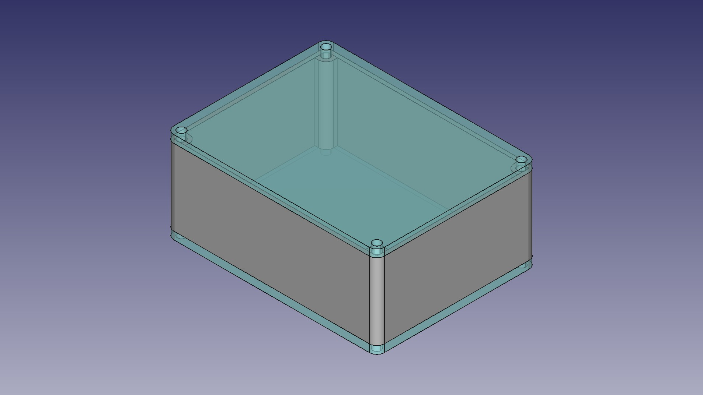

# That Other Box

The other box that I always end up designing for every project.
Obviously for times when [that box](https://github.com/DanNixon/that-box) is not appropriate

Requires [FreeCAD](https://www.freecad.org/) with the [Assembly4 workbench](https://github.com/Zolko-123/FreeCAD_Assembly4).

Parameters are defined in `Variables` in the assembly.
All are in mm and hopefully pretty self explanatory.
